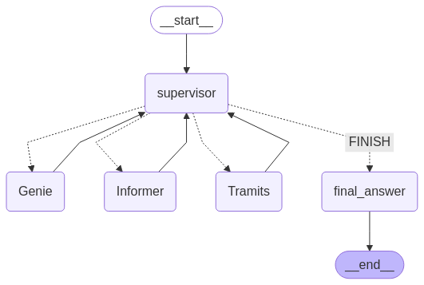
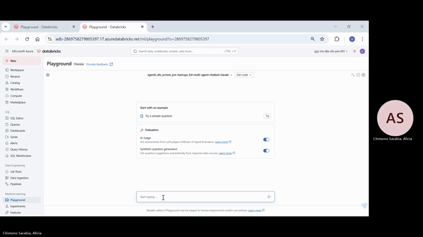

# Generative AI Multi-Agent System on Databricks

This project demonstrates how to build, deploy, and evaluate a generative AI multi-agent system using the Databricks. It showcases the integration of tools like LangChain, Mosaic AI, MLflow, and external LLMs to deliver intelligent, autonomous agents.

 ## 🚀 Use Case :  Catalonia Multi-agent Startup assistant
Help new entrepreneurs navigate the complex process of starting a business by guiding them through official procedures and documents from trusted sources. This is achieved using Retrieval-Augmented Generation (RAG) combined with a multi-agent architecture.

Built with **Databricks Mosaic AI, LangChain, MLflow, and LLMs (Llama and Claude)**

## 🗂️ PROJECT STRUCTURE
```
src/
├── data/
│   ├── import-dades-obertes-api.py (private)
│   ├── import-csv-into-volume.py (private)
│   ├── web-scrapping.py (private)
├── vector_search/
│   ├── vector-search-documentation.py # Vector search creation for the documentation sources. (private)
│   ├── vector-search-tramits.py # Vector search creation for the tramit sources. (private)
├── architecture/
│   ├── langgraph-multiagent-genie-pat # Development and deploy of the model (private)
│   ├── agent.py # Architecture multi-agent (public)
├── evaluation/
│   ├── run_evaluation.py        # Scripts to run evaluations (using MLflow, Mosaic AI) (private)
├── models/
│   ├── (private)
├── utils/
├── config/
└── __init__.py

data/
│   ├── corpus-documents/
│   ├── datasets/
│   ├── evaluation-datasets/

```

## 🔁 DEVELOPMENT WORKFLOW
1. Ingest & Preprocess: Load datasets into Unity Catalog and preprocess.
2. Indexing: Build vector search indices.
3. Model Design: Develop a LangGraph-based multi-agent architecture.
4. Deploy & Test: Serve agents with Mosaic AI, test via AI Playground or APIs.
5. Evaluate & Iterate:  Use MLflow for experiment tracking and agent evaluation.
7. Productionize: Implement monitoring, safety guardrails, and governance policies.

## 🔧 KEY TECHNOLOGIES
- Databricks
    - Unity Catalog (Data and model governance)
    - Mosaic AI (Model Serving, Vector Search, Agent Evaluation)
    - Genie
- MLflow (Experiment tracking and evaluation)
- External LLMs ( Llama, Claude)

## LangGraph architecture


## DEMO GIF



